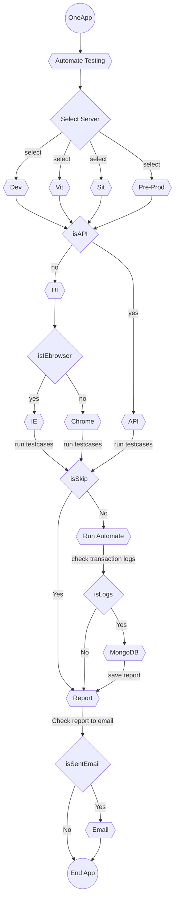

# How to create/run test cases
## Flowcharts for Automate testing


## Example file
- Example_Suite_Api.xml
- src/test/java/com/ttbbank/oneapp/runner/platform2/api/LoginTest.java
- src/test/java/com/ttbbank/oneapp/runner/platform2/api/BiometricConsent.java
#
### Example_Suite_Api.xml
```xml
<!DOCTYPE suite SYSTEM "https://testng.org/testng-1.0.dtd" >
<suite name="Automation-Testing-API" >
	<parameter name="environment" value="dev"/>
	<parameter name="generateExportExcelFile" value="true"/>
	<parameter name="sendExportEmail" value="true"/>
	<parameter name="projectName" value="OneApp"/>
	<parameter name="teamName" value="ExampleTeam"/>
	<test name="Login">
		<classes>
			<class name="com.ttbbank.oneapp.runner.platform2.api.LoginTest"/>
			<class name="com.ttbbank.oneapp.runner.platform2.api.BiometricConsent"/>
		</classes>
	</test>
</suite>
```
- environment = dev, vit, sit, uat, pre
- generateExportExcelFile = false, true
- sendExportEmail = false, true
- projectName = XXXXXX
- teamName = YYYYYY
#
### Testcases.java
- Example I
```java
public class Xy extends BaseScenarioApi {

    String apiPath = "/apis/xy";

    void verifyBiometricConsentService(String testCaseID, boolean isScenario) throws IOException, DocumentException {

       ...
       ...
       ...

    }

    @Test(priority = 1)
    void biometricConsentPass() throws ParseException, IOException, DocumentException {
        String testCaseID = "xy_01";
    }

    @Test(priority = 2)
    void biometricConsentSkip() throws ParseException, IOException, DocumentException {
        String testCaseID = "xy_02";
    }
```
#### Note: extends BaseScenarioApi
- Example II
```java
public class BiometricConsent extends BaseScenarioApi {

    String apiPath = "/apis/customers/ekyc/biometricConsent";

    void verifyBiometricConsentService(String testCaseID, boolean isScenario) throws IOException, DocumentException {

        BiometricConsentPassModel dataModel = new Gson().fromJson(String.valueOf(com.tmb.automation.util.GetJsonData.getBiometricConsentTestCase().get(testCaseID)), BiometricConsentPassModel.class);
        new Common().addScenarioNameToReport(isScenario, dataModel.ScenarioName); //generate scenario to report .html
        new Common().addDescriptionToReport(dataModel.Description); //generate description to report .html
        isSkipTest(dataModel.IsSkip, dataModel.Description);// skip testcase
        new Common().addUrlApiPathToReport(apiPath); //generate apiPath to report .html
        new Common().addExpectedResultToReport(dataModel.ExpectedResult); //generate expected result to report .html
        new Common().addRequestBodyApiToReport(new Gson().toJson(dataModel.TestData.body)); //generate requestbody to report .html
        httpRequest.body(dataModel.TestData.body); //add httpRequest body
        response = httpRequest.filters(logsFilter).request(Method.POST, Setting.baseUrlApi + apiPath); //get response
        BaseApiModel responseModel = new Gson().fromJson(response.getBody().asString(), BaseApiModel.class);//convert response to json
        boolean isPass = String.valueOf(response.getStatusCode()).equals(dataModel.ExpectedResultKey[0]); //Assert test
        new Common().addResponseApiToReport(isPass, response.getBody().asString()); //generate response to report .html
        new Common().exportExcelToTestcase(dataModel.Description, dataModel.ExpectedResult, response.getStatusCode(), logsFilter.getRequestBuilder().toString(), ConvertStringToJson.jsonFormat(response.getBody().asString()), "", isPass); //generate response to report excel file
        Assert.assertTrue(isPass);
        Assert.assertEquals(responseModel.status.code.toLowerCase(),    dataModel.ResponseBody.status.code.toLowerCase());
        Assert.assertEquals(responseModel.status.message.toLowerCase(), dataModel.ResponseBody.status.message.toLowerCase());
        Assert.assertEquals(responseModel.status.service.toLowerCase(), dataModel.ResponseBody.status.service.toLowerCase());

    }

    @Test(priority = 1)
    void biometricConsentPass() throws ParseException, IOException, DocumentException {
        String testCaseID = "TC_OneApp1682_CC_BiometricConsent_0001";
        addHeader();
        verifyBiometricConsentService(testCaseID,true);
    }

    @Test(priority = 2)
    void biometricConsentSkip() throws ParseException, IOException, DocumentException {
        String testCaseID = "TC_OneApp1682_CC_BiometricConsent_0002";
        verifyBiometricConsentService(testCaseID,false);
    }
```
#
### GetJsonData.java
```java
public class GetJsonData {

    public static JSONObject getLoginTestCase() {
        return ReadJson.readJson("/src/main/resources/example/json/login_testcase_"+ Setting.SERVER+".json");
    }

    public static JSONObject getBiometricConsentTestCase() {
        return ReadJson.readJson("/src/main/resources/example/json/biometric_consent_testcase_"+ Setting.SERVER+".json");
    }

    public static JSONObject getEnvironment() {
        return ReadJson.readJson("/src/main/resources/example/json/environment.json");
    }

    public static JSONObject getExample() {
        return ReadJson.readJson("/src/main/resources/example/json/example_.json");
    }
}

```
#
### jsonFile.json
- Example I
    - example_testcases_dev.json
    - example_testcases_vit.json
    - example_testcases_sit.json
    - example_testcases_uat.json
    - example_testcases_pre.json
- Example II
```json
{
  "TC_OneApp1682_CC_LogIn_0001": {
    "ScenarioName": ,
    "Description": ,
    "ExpectedResult": [],
    "TestData": {
      "body": {},
      "headers": {}
    },
    "ExpectedResultKey": [],
    "ResponseBody": {
      "status": {},
      "data": {}
    },
    "MongoDBLogs": [],
    "IsSkip": false
  }
}
```
- Example III
```json
{
  "TC_OneApp1682_CC_LogIn_0001": {
    "ScenarioName": "Verify Login success",
    "Description": "[Login Page]-[Verify Service]-[Given:Verify Login service, When:User input username/password and click 'Login' button, Then: Should be login success]-(username: occ_040)",
    "ExpectedResult": [
      "1. Login success",
      "2. Activity Log '9001001'",
      "3. Activity Log Description 'Log in - OneApp'"
    ],
    "TestData": {
      "body": {
        "username": "test",
        "password": "123",
        "grant_type": "password",
        "scope": "mobile"
      },
      "headers": {
      }
    },
    "ExpectedResultKey": [
      "200"
    ],
    "ResponseBody": {
      "status": {
        "code": "0000",
        "message": "success",
        "service": "oneapp-ex-gw-service",
        "description": "success"
      },
      "data": {
        "access_token": "eyJhbGciOiJIUzI1NiIsInR5cCI6IkpXVCJ9...",
        "token_type": "bearer",
        "refresh_token": "eyJhbGciOiJIUzI1NiIsInR5cCI6IkpXVCJ9...",
        "expires_in": 299,
        "scope": "mobile",
        "channel": "mbl",
        "ssid": "00000018592884-sjqonqlu",
        "jti": "53e2fddc-9e14-457a-942b-75f7e66ff908"
      }
    },
    "MongoDBLogs": [
      {
        "activity_type_id": "9001001",
        "activity_type": "LOG IN - CUSTOMERCARE",
        "activitydescription": [
          {
            "flex": "LOGIN"
          }
        ]
      }
    ],
    "IsSkip": false
  }
}
```


